¡¡¡ガバガバEnglish注意報発令中!!!

# Table of Contents
- [Table of Contents](#table-of-contents)
- [Descriptions](#descriptions)
- [Architecture](#architecture)
  - [Overview](#overview)
  - [Block diagram](#block-diagram)
  - [Instructions list](#instructions-list)
- [Software](#software)
- [List of files and folders](#list-of-files-and-folders)

# Descriptions

A 4- or 8-bit CPU made with 74-series logic ICs.

# Architecture
## Overview

The CPU has an 8-bit wide address bus and a 4-bit wide data bus.
All of instructions are 8-bit wide.

## Block diagram

## Instructions list

Please refer to [here](https://github.com/nasu8151/HC4/blob/main/instructions_manual.md).

# Software
Work in Progress... Please wait.

# List of files and folders

[README.md](https://github.com/nasu8151/HC4) : This file.
[instructions_manual.md](https://github.com/nasu8151/HC4/blob/main/instructions_manual.md) : Instruction manual.
[verilog/HC4](https://github.com/nasu8151/HC4/blob/main/verilog/HC4) : Verilog simulation files of the HC4 CPU.
[verilog/HC8](https://github.com/nasu8151/blob/main/HC4/verilog/HC8) : Verilog simulation files of the HC8 CPU.
[HC4_KiCad](https://github.com/nasu8151/HC4/blob/main/HC4_KiCad) : Schematics and board of HC4.