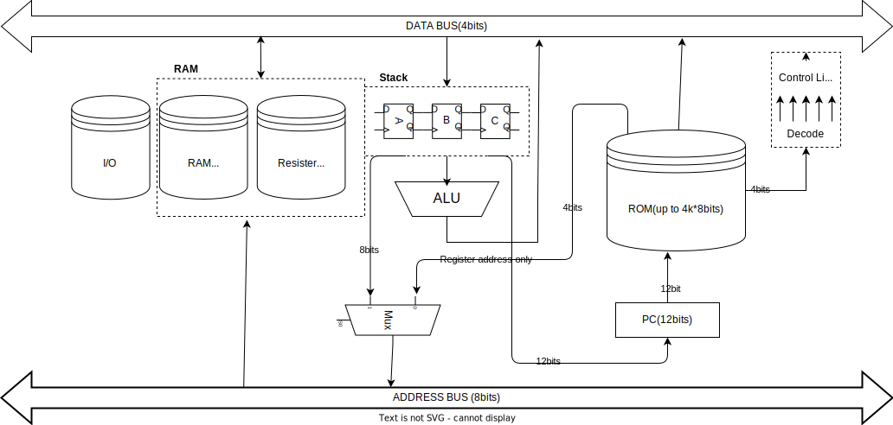

¡¡¡ガバガバEnglish注意報発令中!!!

# Table of Contents
- [Table of Contents](#table-of-contents)
- [Descriptions](#descriptions)
- [Architecture](#architecture)
  - [Overview](#overview)
  - [Block diagram](#block-diagram)
  - [Instructions list](#instructions-list)
- [Software](#software)
- [List of files and folders](#list-of-files-and-folders)

# Descriptions

A 4- or 8-bit CPU made with 74-series logic ICs.

# Architecture
## Overview

HC4 has an 8-bit wide address bus and a 4-bit wide data bus.
All of instructions are 8-bit wide.

## Block diagram

## Instructions list

Please refer to [here](https://github.com/nasu8151/HC4/blob/main/UsersManual_Software.md).

## Schematics and Boards

If you don't have [KiCAD](https://www.kicad.org/), you can use KiCanvas to see our schematics and boards.
* [HC4](https://kicanvas.org/?repo=https%3A%2F%2Fgithub.com%2Fnasu8151%2FHC4%2Ftree%2Fmain%2FHC4_KiCad)
* [HC4E](https://kicanvas.org/?repo=https%3A%2F%2Fgithub.com%2Fnasu8151%2FHC4%2Ftree%2Fmain%2FHC4_KiCad_EE)

# Software

## Assembler

The assembler for this CPU can be found [here](https://github.com/nasu8151/hcxasm).
Please see the documents for syntax and other details.

## HC4eROMandRAM

This is a ROM/RAM emulator for HC4E.

# List of files and folders

<pre>
.
├─extra
├─HC4eROMandRAM
│  └─inst
├─hc4_asm
│  └─src
│      └─debug_data
├─HC4_KiCad
│  ├─HC4_gbr
│  ├─Library.pretty
│  └─sim
├─HC4_KiCad_EE
│  ├─HC4_KiCad_EE-backups
│  ├─Library.pretty
│  └─production
├─HC_MemoryBoard
│  ├─production
│  └─ThroughHole.pretty
└─verilog
    ├─HC4
    ├─HC4e
    └─HC8
</pre>

* [README.md](https://github.com/nasu8151/HC4) : This file.
* [UsersManual_Software.md](https://github.com/nasu8151/HC4/blob/main/UsersManual_Software.md) : Instruction manual.
* [hc4_asm/](https://github.com/nasu8151/HC4/blob/main/hc4_asm) : [DEPRECATED] : [Use new assembler](https://github.com/nasu8151/hcxasm). An assembler for the HC4 CPU.
* [HC4_KiCad](https://github.com/nasu8151/HC4/blob/main/HC4_KiCad) : Schematics and a board of the HC4.
* [HC4_KiCad_EE](https://github.com/nasu8151/HC4/blob/main/HC4_KiCad_EE) : Schematics and a board of the HC4E (Used to be called "HC4 Education Edition").
* [HC_MemoryBoard](https://github.com/nasu8151/HC4/blob/main/HC4_KiCad_EE) : A schematic and a board for SRAM and I/O.
* verilog/
  * [verilog/HC4](https://github.com/nasu8151/HC4/blob/main/verilog/HC4) : Verilog simulation files of the HC4 CPU.
  * [verilog/HC8](https://github.com/nasu8151/blob/main/HC4/verilog/HC8) : Verilog simulation files of the HC8 CPU.
  * [verilog/HC4e](https://github.com/nasu8151/blob/main/HC4/verilog/HC8) : Verilog simulation files of the HC4e CPU.
